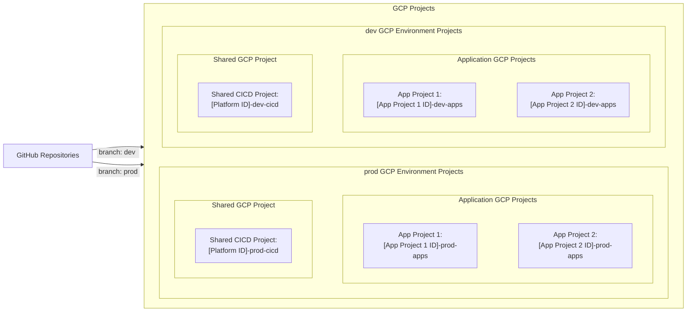
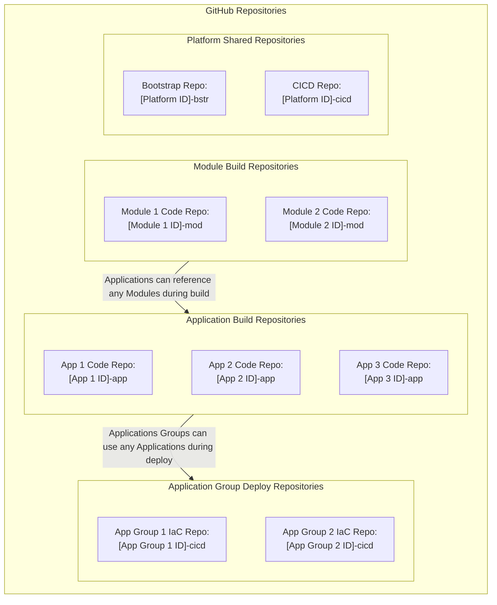

Copyright 2026 Czeslaw Szubert

> **⚠️ DISCLAIMER: Experimental Platform**
> 
> This project is an **experimental platform** and is **not intended or ready for enterprise production workloads**. The code is provided "as-is", without warranty of any kind, express or implied, including but not limited to the warranties of merchantability, fitness for a particular purpose and noninfringement. In no event shall the authors or copyright holders be liable for any claim, damages or other liability, whether in an action of contract, tort or otherwise, arising from, out of or in connection with the software or the use or other dealings in the software. Use at your own risk.

## Table of Contents

- [Introduction](#introduction)
- [Platform Overview](#platform-overview)
  - [Key Platform Organization Concepts & Naming Conventions](#key-platform-organization-concepts--naming-conventions)
  - [Resource Nomenclature](#resource-nomenclature)
- [Platform Design Details](#platform-design-details)
  - [Environments](#environments)
    - [Non-production environments](#non-production-environments)
    - [Production environment](#production-environment)
  - [GCP Projects](#gcp-projects)
    - [Example GCP Projects](#example-gcp-projects)
  - [CICD Pipelines & Git Repositories](#cicd-pipelines--git-repositories)
    - [Example Git Repositories](#example-git-repositories)
  - [CICD Pipeline Descriptions](#cicd-pipeline-descriptions)
    - [Platform Bootstrap Pipeline](#platform-bootstrap-pipeline)
    - [Platform CICD Pipeline](#platform-cicd-pipeline)
    - [Build Pipelines](#build-pipelines)
    - [Deploy Pipelines](#deploy-pipelines)
  - [Teardown and Cleanup](#teardown-and-cleanup)

# Introduction
This README describes the GCP Platform and the provided repository templates used to create the platform.

This repository is the template for the **Platform Bootstrap Repository**, which is the first repository used to create the GCP Platform. This repository is used to initialize the foundational CICD GCP projects and resources needed to execute Cloud Build pipelines. 

# Platform Overview
This platform provides a standardized, automated framework for bootstrapping and managing Google Cloud Platform (GCP) environments using Terraform and Cloud Build. It is composed of a suite of repositories including this **Bootstrap repository** (for initial project setup and CICD foundation), a **CICD repository** (for managing application pipelines and cross-project permissions), and various **Application repositories** - consisting of application build and deploy repositories as needed.

By leveraging a "pipeline-as-code" approach, it ensures consistent resource nomenclature, centralized state management, and clear separation between production and non-production environments.

## Key Platform Organization Concepts & Naming Conventions
The following key concepts are used to organize the repositories, pipelines, GCP projects, and deployed application resources.

### Platform ID
Platform ID is a unique identifier used for standard nomenclature when creating GitHub repositories, GCP projects, and for nomenclature of the platform's CICD pipelines and associated resources.

To comply with GitHub repository names and GCP resource names, the Platform ID must be no longer than 15 characters, must use only lowercase letters (a-z), numbers (0-9), and hyphens (-), and begin with a letter.

### GCP Projects
Two types of GCP projects are used in the platform:
- CICD Pipelines Projects: housing the Cloud Build pipelines and built artifacts.
- Application Projects: housing the resources and data for one or more application.

### Environment Name
Each GCP environment is defined by a branch in the git repos. The destination GCP projects for each environment are configurable, so that each environment can be deployed to distinct GCP projects, creating a clear separation between environments. Alternatively, some environments (for example `dev` and `uat`) can be deployed to the same GCP projects to avoid project sprawl. The CICD GCP project (one per environment) is used to house the build and deployment pipelines and artifacts. 

Each Environment Name must be no longer than 4 characters, and must use only lowercase letters (a-z), numbers (0-9), and hyphens (-).

### Pipeline ID
Each CICD Pipeline consists of a GitHub Repository and a Cloud Build Trigger for each environment, deployed to a corresponding CICD GCP project. Code commits to an environment branch in GitHub triggers the corresponding environment's pipeline. For security, each time the pipeline is triggered, a user must approve the Cloud Build execution in GCP Console.

The types of pipelines include:
- Bootstrap Pipeline (to initialize an environment)
- CICD Pipeline (to create all of the below pipelines)
- Module Build Pipeline
- Application Build Pipeline
- Application Deployment Pipeline

The Pipeline ID is constructed as follows:
`[Platform ID / Module ID / App ID / App Group ID]-[Pipeline Type]`

### Modules
Modules are code packages that can be used in one or more applications during build. Module artifacts are created by executing the Module Build Pipeline and stored in the CICD Pipeline Project for the environment.

### Applications
Applications are built Docker images, created by executing an Application Build Pipeline. The Docker images are stored in the CICD Pipeline Project for the environment.

### Application Groups
Application groups consist of one or more application and the corresponding Infrastructure as Code (IaC) Terraform code to deploy the application and required resources to the Application Project.

One or more application groups can be deployed to an application GCP project.

### Platform Resources
All GCP resources, including Service Accounts, Cloud Build Triggers, CICD Pipeline GCS Buckets, and all application-specific resources are created using the platform IaC.

With the exception of shared platform resources as described in [Bootstrap Pipeline Usage](docs/Bootstrap_Pipeline_Usage.md), the resources created by the CICD platform pipelines in this platform follow the following nomenclature.

## Resource Nomenclature
| Resource | Nomenclature | Maximum Characters | Remarks |
|---|---|---|---|
| Resource Name | [Pipeline ID]-[Environment]-[Resource ID] | 30 | Must be less than 30 characters long to satisfy the maximum number of characters allowed for the GCP Service Account Name. |
| Resource ID | - | 4 (for service account names) | A resource ID unique within the pipeline.  ex. Cloud Build Service Account: `cbld` |
| Environment | - | 4 | ex. `dev`, `prod` |
| Pipeline ID | [Platform ID / Module ID / App ID / App Group ID]-[Pipeline Type] | 20 | A unique identifier for the pipeline.  ex. `my-plt-dev-cicd`|
| Pipeline Type | - | 4 | ex. `bstr`, `cicd`, `mod`, `app`, `iac`|
| Platform ID / Module ID / App ID / App Group ID | - | 15 | A unique identifier for the platform, module, application, or application group.  ex. `my-plt`, `my-module`, `my-app`, `my-app-group`|

# Platform Design Details
## Environments

The platform deploys each environment based on the git repo branch name.  The corresponding environment specific IaC code and configurations are stored in the subfolder `environments/[Environment Name]`.

**Note:** 
- The git branch name and the corresponding IaC environment-specific subfolder name must match.
- The environment name must: use only lowercase letters (a-z), numbers (0-9), and hyphens (-), begin with a letter, have no leading or trailing hyphens, and be no more than 4 characters to ensure resource name length limits are not exceeded. If needed, the Terraform code will truncate the environment name to 4 characters and replace any underscores '_' with hyphens '-' to conform with GCP resource nomenclature.

### Non-production environments
You can use any non-production environment names. For example, you can have the following non-production environments:
* `dev`
* `uat`

Each environment can be deployed to a separate GCP project and region as defined in `environments/[Environment Name]/terraform.tfvars`. You can deploy more than one environment to the same GCP project, but it is a good practice to keep the production and non-production environments in separate GCP projects.

### Production environment
The name of the production environment is hard-coded in `cloudbuild.yaml` and `scripts/tf.sh` to:
* `prod`

This is used as a safeguard for destroy prevention during the teardown and cleanup automation.

## GCP Projects
To eliminate the need for a Service Account with elevated permissions, all GCP projects must be created manually and connected to a billing account before executing the pipelines. This provides a good balance between simplicity and control and is optimal for an experimental project platform; for enterprise grade platforms this strategy needs to be improved. After project creations, all other project settings are managed by the CICD pipelines.

The platform defines the below GCP project types:

| Type of Project | Recommended Project ID | Description | Recommended Environments & App project Names |
|---|---|---|---|
| CICD Pipeline Project(s) | [Platform ID]-[Environment Name(s)]-cicd  ex.  - `my-plt-dev-cicd`  - `my-plt-prod-cicd` | House the Cloud Build pipelines and artifacts for the environment(s). | Production environment `prod` should be separated in its own GCP projects. Other environments can share a common set of GCP projects. |
| App Project(s) | [App Project ID]-[Environment Name(s)]-apps  ex.  - `app-pr1-dev-apps` - `app-pr1-prod-apps` | House the Application and data for the environment(s). | An App project can house one or more app groups.    Production apps should be separated from non-production apps in a production apps project(s).

### Example GCP Projects
The below example shows GCP projects for a platform with 2 application GCP projects, deployed to 2 environments: `dev` and `prod`.

## CICD Pipelines & Git Repositories

The platform defines the following CICD pipelines:

| Pipeline Name | Template Repository |  Pipeline ID* | Pipeline Execution Location** | Target Project for Deployed Resources |
|---|---|---|---|---|
| Platform Bootstrap | https://github.com/czeslaw2040/cs-gcp-plt-bstr | [Platform ID]-bstr  ex.  `my-plt-bstr` | CICD Project   (First time executed manually: `scripts/bootstrap.sh`) | CICD Project |
| Platform CICD | https://github.com/czeslaw2040/cs-gcp-plt-cicd | [Platform ID]-cicd  ex.  `my-plt-cicd` | CICD Project | CICD Project and App Group Project |
| (Optional) Module Build Pipelines | - | [Module ID]-mod  ex.  `my-module-mod` | CICD Project | CICD Project |
| Application Build Pipelines | https://github.com/czeslaw2040/cs-ex-ingest-app | [App ID]-app  ex.  `my-app-app` | CICD Project | CICD Project |
| Deploy Pipelines | https://github.com/czeslaw2040/cs-ex-ingest-iac | [App Group ID]-iac  ex.  `my-app-iac` | CICD Project* | App Group Project |

**Note**:
- *It is recommended to keep the Git Repo Names the same as the Pipeline IDs.
- **IaC Pipelines are normally executed with Cloud Build pipelines using the platform-created **Cloud Build Service Account**. For executions requiring elevated permissions, the provided `scripts/tf.sh` and `scripts/bootstrap.sh` can be executed in Cloud Shell by a user with appropriate permissions. This eliminates the need for a service account with elevated permissions. This provides a good balance between simplicity and control and is optimal for an experimental project platform; for enterprise grade platforms this strategy needs to be improved.

### Example Git Repositories
The below example shows GitHub repositories for a platform with 2 environments and 3 applications, distributed across 2 application groups.

## CICD Pipeline Descriptions

### Platform Bootstrap Pipeline
The Platform Bootstrap pipeline initializes the foundational CICD GCP projects and resources needed to execute Cloud Build pipelines. This includes setting up buckets, service accounts, and pipeline triggers for subsequent automated deployments.

#### Initial Bootstrap execution with `scripts/bootstrap.sh`:
1. Prompt the user to connect Git Repositories to the CICD GCP project.
1. Execute Terraform IaC, storing initial state files locally.
1. Migrate initial state files to the created State File GCP bucket.

#### Subsequent Cloud Build or `scripts/tf.sh` execution:
1. Execute the Terraform IaC, storing state files in the designated GCS bucket.

#### Bootstrap IaC Terraform includes: 
1. Enable required APIs in the CICD Pipeline Project.
1. Create a Platform Cloud Build SA to execute Platform Bootstrap and Platform CICD pipelines.
1. Grant SA permissions needed to execute the pipelines.*
1. Create Terraform state file bucket to store state files for all platform pipelines.
1. Create Cloud Build logs bucket to store all Cloud Build logs.
1. Create Platform Bootstrap pipeline trigger for subsequent executions of this pipeline.
1. Create Platform CICD pipeline trigger.

*Granting new permissions to the Platform Service Account will require execution by user with appropriate access.

For detailed instructions see [Bootstrap Pipeline Usage](docs/Bootstrap_Pipeline_Usage.md).

### Platform CICD Pipeline 
The Platform CICD pipeline creates the individual Build and Deployment pipeline triggers. It also creates the individual Service Accounts to execute each deployment pipeline, ensuring the principle of least privilege is maintained for each deployment pipeline.

It initializes the target application GCP projects, manages essential APIs, and configures cross-project IAM permissions for the Cloud Build service account. Additionally, it establishes the automated build and deployment pipeline triggers required for individual applications.

#### Cloud Build or `scripts/tf.sh` execution:
1. Create App Build & Deploy Pipeline Triggers
1. Initialize App GCP projects:
    * Grant permissions to the corresponding pipeline's Cloud Build SA.*
1. Common App Project setup (non App specific):
    * Manage APIs
    * **Note:** Common setup may be moved out of bootstrap in the future.

*Granting new permissions will require execution by user with appropriate access. This will be required when new permissions will need to be granted based on application requirements - the Cloud Build Service account will need appropriate escalation roles in the target project when creating and setting permissions on any application service accounts. 

For detailed instructions see the corresponding Application Build Pipeline repository.

### Build Pipelines
The Build Pipeline builds the application artifact, for example a Docker image, or a module artifact. The artifacts are stored in the CICD GCP project for a given environment.

#### Cloud Build execution:
1. Build modules and apps. Builds and artifacts are stored in the environment specific CICD GCP projects.

For detailed instructions see the corresponding Application Build Pipeline repository.

### Deploy Pipelines
The Deploy Pipeline creates the infrastructure for the specific application group in a given environment.

#### Cloud Build or `scripts/tf.sh` execution:
1. Deploy App Group resources to an App GCP projects.

For detailed instructions see the corresponding Application Build Pipeline repository.

## Teardown and Cleanup
To remove the resources created by these pipelines in a specific environment (for example to remove the `dev` resources after a release to production), it is recommended to use the Cloud Build pipelines, passing the `destroy` flag. 

Normally only the application resources need to be removed from an environment, (the CICD pipelines do not carry significant cost).  However, to remove all resources in an environment, the teardown must be performed in the reverse order, starting with each Application Group Deployment Pipeline, followed by the Platform CICD Pipeline and then the Platform Bootstrap Pipeline. Note, artifacts created by the Build Pipelines will not be deleted during teardown, so any artifacts that need to be removed must be deleted manually.
